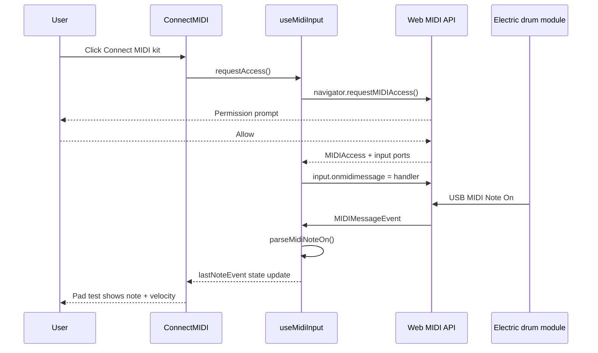

# MIDI Phase A — Step 1: Connect & Pad Test

This document explains **what was built in Step 1** of MIDI support: connecting an electric drum kit in the browser and confirming that pad hits are received. It does **not** yet play sounds in Practice or grade play-along timing — that comes in later steps.

For the full MIDI teaching roadmap (play-along scoring, Progress screen, etc.), see the conversation plan in the project history; Step 2 wires pads to the virtual kit on **Practice**.

---

## Goal of Step 1

Answer one question: **“Does the app hear my drum kit?”**

Before mapping MIDI notes to app drums or scoring exercises, we need:

1. Browser permission to access MIDI devices (Web MIDI API).
2. A way to pick which USB MIDI input is the drum module.
3. A **pad test** panel that shows each hit (note number, name, velocity).

If snare shows something like **Acoustic snare · note 38 · velocity 50**, Step 1 succeeded.

---

## How to connect your drum kit to a laptop

This section is for **hardware setup** (cables, module, laptop). The app steps in the next section assume the kit is already sending MIDI to the computer.

### What you need

| Part | What it is |
| --- | --- |
| **Drum module (brain)** | The small box on the rack that all pads plug into; it turns pad hits into MIDI data |
| **Pads & cables** | Already wired to the module from the factory or your kit build |
| **USB cable** | Usually **USB A → USB B** (printer-style plug into the module) or **USB A → USB C** depending on the module |
| **Laptop** | Windows or Mac with a free USB port (or USB-C adapter/hub) |
| **Browser** | **Google Chrome** or **Microsoft Edge** (recommended for Web MIDI) |

You do **not** need to install a DAW (Reaper, GarageBand, etc.) for Step 1. The app talks to the kit directly through the browser.

### Physical connection (step by step)

1. **Set up the kit**  
   Make sure all pads are plugged into the module and the module is mounted firmly (on the rack or stand).

2. **Find the USB port on the module**  
   Look on the **back or side** of the brain for a port labeled **USB**, **USB-MIDI**, or **COMPUTER**.  
   Common shapes:
   - **USB B** (square-ish) — very common on Roland, Alesis, Yamaha, Simmons, etc.
   - **USB C** — on some newer modules

3. **Plug USB into the module, then the laptop**  
   - Connect the cable to the **module first**, then to the **laptop**.  
   - If your laptop only has **USB-C**, use a **USB-C hub or adapter** (USB-A adapter is fine).  
   - Prefer plugging **directly into the laptop** rather than through an unpowered hub if you have connection issues.

4. **Power on the module**  
   - Turn on the drum brain with its power switch or power adapter.  
   - Wait until the screen finishes booting (a few seconds).  
   - You may hear a short sound or see a home screen — that is normal.

5. **Check the laptop sees USB (optional but helpful)**  
   - **Windows:** Settings → **Bluetooth & devices** → **Devices** — you may see the kit name, or it appears as a generic MIDI device. Some brands install a small driver; most kits are **plug-and-play**.  
   - **Mac:** **System Settings** → **Privacy & Security** — no extra step usually; Mac treats class-compliant MIDI over USB automatically.  
   - You do **not** need to select the kit as the laptop’s “speakers” — MIDI is separate from audio playback.

6. **Use headphones on the module (optional)**  
   If you want to hear your kit’s **built-in sounds** while testing, plug headphones into the **module**, not only the laptop.  
   Step 1 in the app only checks **MIDI data** (pad test), not laptop speaker output from the kit.

### Common connection mistakes

| Problem | What to try |
| --- | --- |
| Nothing happens when you hit pads | Module not powered on; wrong USB port on module (some have multiple ports — use **USB-MIDI / COMPUTER**) |
| Laptop does not react to USB | Try another cable (many “charge-only” cables do not carry data); try another USB port |
| Device appears then disappears | Loose cable; hub without enough power — plug module directly into laptop |
| You only have audio, no MIDI in app | You may be using **audio-only** routing; this app needs **USB MIDI**, not the headphone output of the laptop |

### After hardware is connected — in the app

Once the kit is on and linked by USB, continue in the Drum Kit Learning Platform:

1. Plug the drum module into the computer via **USB** and turn it on *(done above)*.
2. Open the app → **Connect MIDI** (home tile or `/connectmidi`).
3. Use **Chrome or Edge** on desktop (Web MIDI is not reliably available in all browsers).
4. Click **Connect MIDI kit** and allow MIDI access when prompted.
5. If multiple inputs appear, select the correct device (e.g. your module name).
6. Scroll to **Pad test** and hit pads — each strike updates the display.

**Success looks like:** hitting snare shows **Acoustic snare**, **note 38**, and a **velocity** number (e.g. 50). Other pads should show different note numbers.

The Connect MIDI page is **scrollable** so **Pad test** stays reachable on smaller laptop screens.

---

## What the user does (quick checklist)

Same flow as above, for reference:

1. USB + power on module → 2. **Connect MIDI** in app → 3. Chrome/Edge → 4. **Connect MIDI kit** → 5. Pick device → 6. **Pad test**

---

## What Step 1 does *not* do

| Not included yet | Planned for |
| --- | --- |
| Triggering sounds on **Practice** | Step 2 |
| Custom pad → drum mapping UI | Step 2 |
| Play-along timing / accuracy feedback | Phase B |
| Saving hit history to **Progress** | Phase C |
| Bluetooth MIDI (depends on OS/browser) | Maybe later |

---

## Files added or changed

### New types

| File | Purpose |
| --- | --- |
| `src/types/midiTypes.ts` | `MidiConnectionStatus`, `MidiInputSummary`, `MidiNoteEvent` |

### New utilities (`src/utils/midi/`)

| File | Purpose |
| --- | --- |
| `midiSupport.ts` | Detects if `navigator.requestMIDIAccess` exists; user-facing unsupported-browser message |
| `parseMidiMessage.ts` | Reads **Note On** MIDI messages (ignores note-off / non-note traffic) |
| `generalMidiDrums.ts` | Human-readable labels for common GM drum notes (e.g. 38 → “Acoustic snare”) |

### New hook

| File | Purpose |
| --- | --- |
| `src/hooks/useMidiInput.ts` | Web MIDI lifecycle: request access, list inputs, attach listener, expose last hit |

### Updated screen

| File | Purpose |
| --- | --- |
| `src/screens/ConnectMIDI.tsx` | Replaced placeholder with Connection, device list, and Pad test UI |
| `src/screens/styles/ConnectMIDI.css` | Glass panels, scrollable full-viewport layout, studio CSS variables |

---

## How it works (technical overview)



### Connection flow (`useMidiInput`)

1. **`requestAccess()`** calls `navigator.requestMIDIAccess({ sysex: false })`.
2. All **MIDI inputs** are listed (id, name, manufacturer, connected/disconnected state).
3. The hook attaches `onmidimessage` to the selected input.
4. **`onstatechange`** refreshes the list when devices are plugged or unplugged.
5. **`disconnect()`** removes the listener and clears selection.

### Persisted preference

| Key | Value |
| --- | --- |
| `localStorage` key `drumkit.midi.selectedInputId` | ID of the last chosen MIDI input |

On the next connect, the app tries to re-select that device automatically.

### Parsing a pad hit

Electric kits usually send **Note On** messages:

- **Note number** — which pad (General MIDI percussion map; snare is often **38**).
- **Velocity** — how hard (1–127; your module may default to ~50 for medium hits).
- **Channel** — often channel 10 for drums (stored but not shown prominently in UI yet).

`parseMidiNoteOn()` only treats **Note On with velocity &gt; 0** as a hit (velocity 0 is sometimes used as Note Off on the same command).

### Pad test display example

If you hit the snare and see:

```
Acoustic snare
Note 38 · velocity 50
```

That means:

- **38** = GM acoustic snare (common factory mapping).
- **50** = medium strength on a 0–127 scale.
- The label comes from `generalMidiDrums.ts`, not from your kit’s brand name.

Different brands may use different note numbers for some pads; Step 2 will add **mapping** to the app’s drum ids (`snare`, `kick`, etc.).

---

## Browser and hardware notes

| Topic | Detail |
| --- | --- |
| **Supported browsers** | Chrome, Edge, Opera (desktop) recommended |
| **Safari / Firefox** | Limited or no Web MIDI — show unsupported message |
| **HTTPS** | Web MIDI requires a secure context; `localhost` is fine for development |
| **USB** | Most e-drum brains appear as a USB MIDI device |
| **Latency** | Small delay is normal; calibration may be added in later steps |

---

## UI layout fix (scroll)

Early versions used `min-height: 100vh` on a `position: fixed` container without a fixed height, so the box grew with content and **Pad test** could sit below the visible area with no scroll.

**Fix:** `height: 100vh` / `100dvh` + `overflow-y: auto` on `.connectmidi-container` so the whole Connect MIDI page scrolls inside the viewport.

---

## Architecture fit

- **No backend** — MIDI stays in the browser, matching `templates/architecture.md`.
- **No new npm packages** — uses the built-in Web MIDI API.
- **`src/hooks/useMidiInput.ts`** — reusable hook for Step 2 (Practice) and later screens.
- **Templates** — `project-overview.md` and `architecture.md` list Connect MIDI and Practice MIDI as working; play-along scoring remains Phase B.

---

## How to verify Step 1

1. Connect kit → **Connect MIDI kit** → allow access.
2. Status shows **Connected to &lt;device name&gt;**.
3. Hit snare → Pad test shows note **38** (or your module’s snare note) and a velocity &gt; 0.
4. Hit kick, hi-hat, toms — note numbers should change per pad.
5. Refresh page, connect again — same device should be pre-selected if still plugged in.

---

## Next: Step 2 (preview)

Step 2 is documented in **`wExplanationFiles/MIDI_PHASE_A_STEP_2.md`** (includes Phase A polish notes). It maps MIDI notes to app drum ids and wires pads to **Practice** sounds via `useMidiInput` + `mapMidiNoteToDrumId`.

---

## Related docs

- `wExplanationFiles/PLAY_ALONG_EXERCISES.md` — play-along player (future MIDI scoring target)
- `wExplanationFiles/PLAY_ALONG_EXERCISES_PLAIN.md` — play-along in plain English
- `templates/project-overview.md` — product scope (Connect MIDI + Practice MIDI documented as working)
