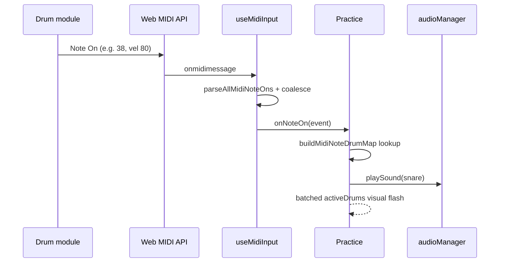

# MIDI Phase A — Step 2: Practice Pad Sounds

This document explains **Step 2** of MIDI support: mapping pad hits to the app’s drum ids and playing the same sounds on **Practice** as keyboard/mouse clicks.

Step 1 (Connect MIDI + pad test) must work first. Step 2 does **not** add play-along scoring or Progress history — that is Phase B/C.

---

## Goal of Step 2

Answer: **“When I hit my kit on Practice, do I hear the same drums as clicking the screen?”**

Success looks like:

1. Kit already connected on **Connect MIDI** (or auto-connect on Practice).
2. Open **Practice** → enter fullscreen.
3. Hit snare on the kit → snare sound + visual hit flash on the kit overlay.
4. Kick, hi-hat, toms, cymbals map to the matching app drums when they use standard General MIDI note numbers.

---

## What the user does

1. **Connect MIDI** — plug in kit, click **Connect MIDI kit**, confirm pad test (Step 1).
2. Go to **Practice** → **Enter Fullscreen**.
3. Play pads — sounds and hit zones should respond like keyboard/mouse.

If MIDI is supported but not connected, Practice shows a hint to use the Connect MIDI page first. When connected, a small **MIDI · device name** badge appears in the top-right during fullscreen.

---

## What Step 2 does *not* do

| Not included yet | Planned for |
| --- | --- |
| Custom pad → drum mapping UI | Later Phase A step |
| Velocity-sensitive volume on Practice | Optional enhancement |
| Play-along timing / accuracy | Phase B |
| Session history on Progress | Phase C |
| Output latency calibration slider | Phase B (scoring) |

---

## Files added or changed

### New utilities (`src/utils/midi/`)

| File | Purpose |
| --- | --- |
| `midiNoteToDrumId.ts` | Default General MIDI note → app drum id map; `buildMidiNoteDrumMap()` for O(1) lookup |
| `parseMidiMessage.ts` | `parseAllMidiNoteOns()` — multi-message packets + running status |
| `midiHitCoalescing.ts` | Collapse hi-hat bursts (42+44); debounce double-fires from e-drum modules |
| `midiSupport.ts` | Browser detection and user-facing unsupported-browser copy |
| `generalMidiDrums.ts` | Human-readable GM drum labels for pad test |

### Hook (`src/hooks/useMidiInput.ts`)

| Option | Purpose |
| --- | --- |
| `onNoteOn` | Callback for each parsed Note On |
| `autoConnect` | Request access on mount; reuse `drumkit.midi.selectedInputId` |
| `trackLastNote` | Pad-test state on Connect MIDI; `false` on Practice for lower latency |

### Updated screens / audio

| File | Change |
| --- | --- |
| `src/screens/Practice.tsx` | Auto-connect MIDI, map notes → drums, low-latency audio path, visual batching |
| `src/screens/styles/Practice.css` | MIDI connected badge + setup hint |
| `src/utils/audioManager.ts` | Web Audio buffers, master bus, warm-up, attack-offset trim, hi-hat choke |
| `src/utils/drumConfig.ts` | Default sample paths aligned to files in `public/audio/` |

---

## Phase A polish (latency & reliability)

Shipped after the initial Step 2 wiring:

| Topic | What changed |
| --- | --- |
| **Latency** | Pre-decode samples; dedicated `AudioContext` with `latencyHint: 'interactive'`; `warmUp()` on fullscreen; skip React updates per MIDI hit on Practice |
| **Sample paths** | Fixed broken paths (e.g. `hihat` → `hihat1.wav`) so pads use real WAVs, not fallback tones |
| **Simultaneous hits** | `parseAllMidiNoteOns()` handles multi-note MIDI packets (snare + cymbal together) |
| **Fast hi-hat** | Choke + 100ms cap on hi-hat voices; keyboard and MIDI share the same audio path |
| **E-drum hi-hat** | Coalesce 42/44/46 in one packet; 28ms debounce for pedal/pad double-fire |

**Headphones vs Bluetooth:** wired output is much tighter; Bluetooth speakers add OS-level delay the app cannot remove. Play-along scoring (Phase B) may add a user latency offset.

---

## Default note mapping

Electric kits often follow **General MIDI percussion** (channel 10). The default table maps common notes to ids from `defaultDrumKit`:

| MIDI note | GM name (typical) | App drum id |
| --- | --- | --- |
| 35, 36 | Bass drums | `kick` |
| 37–40 | Snare / rim / clap / electric snare | `snare` |
| 41 | Low floor tom | `low-floor-tom` |
| 42, 44, 46 | Hi-hat closed / pedal / open | `hihat` |
| 43, 45 | Floor / low tom | `floor-tom` |
| 47, 48 | Mid toms | `mid-tom` |
| 49 | Crash | `crash` |
| 50 | High tom | `high-tom` |
| 51, 53 | Ride / bell | `ride` |
| 52 | Chinese cymbal | `china` |
| 55, 57 | Splash / crash 2 | `crash-2` |

Unmapped notes are ignored (no sound). Different module layouts can be handled later with a custom mapping UI.

---

## How it works (technical overview)

### Practice integration

- `useMidiInput({ autoConnect: true, trackLastNote: false, onNoteOn })` runs when Practice mounts.
- Stored device id (`drumkit.midi.selectedInputId`) from Connect MIDI is reused.
- MIDI hits only fire in **fullscreen** — same rule as keyboard and mouse.
- Audio plays before React visual work; hi-hat MIDI uses debounce/coalesce helpers.

---

## How to verify Step 2

1. Complete Step 1 (pad test shows note 38 for snare, etc.).
2. Open **Practice** → fullscreen.
3. Confirm **MIDI · &lt;device name&gt;** badge (top-right).
4. Hit snare → snare sound + snare hit zone flash.
5. Hit kick, hi-hat, toms — matching sounds when notes match the default table.
6. Keyboard and mouse still work alongside MIDI.
7. Fast hi-hat 8ths on keyboard (H) sound even; e-drum hi-hat should be close (module may send extra MIDI messages).

---

## Related docs

- `wExplanationFiles/MIDI_PHASE_A_STEP_1.md` — connect and pad test
- `templates/project-overview.md` — product scope (Connect MIDI + Practice MIDI listed as working)

---

## Next steps (preview)

- **Phase B:** Play-along “practice with kit” mode — record MIDI hit times, compare to `PlaybackStep` timeline (start with `snare-1`, timing only)
- **Phase C:** Save attempt results on Progress (`localStorage`)
- **Later Phase A:** Custom MIDI note → drum mapping UI + `localStorage` persistence
