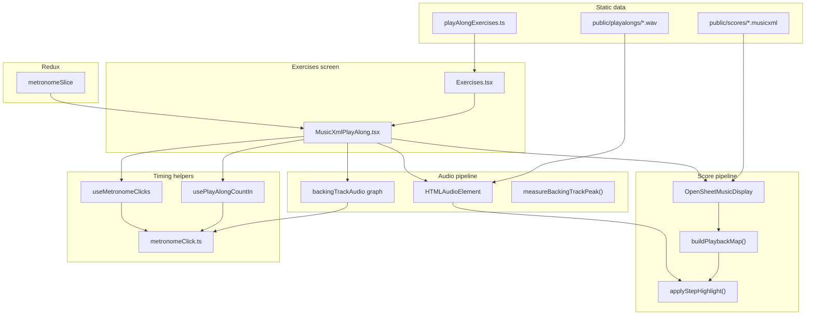

# Play-Along Exercises — How It Works

This document explains the **MusicXML + WAV play-along** feature: how users experience it, how the code is organized, and how timing, score highlighting, count-in, and metronome sync fit together.

Play-along exercises live on the **Exercises** screen alongside the older **VexFlow rhythm** exercises. They are a separate track type: a real drum score (MusicXML) plus a backing audio file, rendered and synchronized entirely in the browser.

---

## Table of contents

1. [What the user sees](#what-the-user-sees)
2. [High-level architecture](#high-level-architecture)
3. [File and folder map](#file-and-folder-map)
4. [Exercise catalog and types](#exercise-catalog-and-types)
5. [How to add a new exercise](#how-to-add-a-new-exercise)
6. [Score loading and rendering (OSMD)](#score-loading-and-rendering-osmd)
7. [Playback map — from MusicXML to highlight steps](#playback-map--from-musicxml-to-highlight-steps)
8. [Backing audio and Web Audio graph](#backing-audio-and-web-audio-graph)
9. [Tempo model — three related BPM values](#tempo-model--three-related-bpm-values)
10. [Play / Stop / count-in flow](#play--stop--count-in-flow)
11. [Score highlight sync during playback](#score-highlight-sync-during-playback)
12. [Optional metronome during the exercise](#optional-metronome-during-the-exercise)
13. [UI controls and persistence](#ui-controls-and-persistence)
14. [Integration with global metronome settings](#integration-with-global-metronome-settings)
15. [Limitations and authoring tips](#limitations-and-authoring-tips)
16. [Troubleshooting sync issues](#troubleshooting-sync-issues)

---

## What the user sees

1. Open **Exercises** from the home navigation.
2. Under **Play-along**, pick an exercise (e.g. “Snare 1”).
3. The player loads:
   - An **SVG drum score** (from MusicXML via OpenSheetMusicDisplay).
   - A hidden **HTML `<audio>`** element for the backing WAV.
4. User adjusts **Tempo** and **Volume** knobs, optionally enables **Metronome**, toggles **light/dark score theme**, and may enter **fullscreen**.
5. Press **Play**:
   - A **4-beat count-in** runs (clicks + on-screen dots).
   - On the downbeat after “4”, the backing track starts and notes on the score **highlight in orange** in time with the audio.
6. Press **Stop** (same button while playing) to reset audio and highlights.
7. When the track **ends**, playback stops, highlights reset, and the metronome turns off automatically.

There is **no MIDI input**, **no recording**, and **no server** — everything runs client-side.

---

## High-level architecture



**Ground truth for musical time during playback:** `audioRef.current.currentTime` (seconds into the WAV file).

**Ground truth for when clicks fire:** Web Audio `AudioContext.currentTime`, scheduled from live media position via `startMediaLockedMetronomeScheduler` so clicks track tempo changes and mid-song metronome toggles.

---

## File and folder map

| Path | Role |
| --- | --- |
| `src/screens/Exercises.tsx` | Exercise picker menu; mounts `MusicXmlPlayAlong` when a play-along is selected |
| `src/components/MusicXmlPlayAlong/MusicXmlPlayAlong.tsx` | Main player: score, audio, transport, knobs, metronome toggle |
| `src/components/MusicXmlPlayAlong/MusicXmlPlayAlong.css` | Player layout and studio styling |
| `src/components/MusicXmlPlayAlong/PlayAlongKnob.tsx` | Tempo / volume rotary controls |
| `src/data/playAlongExercises.ts` | Catalog of exercises (ids, URLs, default BPM) |
| `src/types/playAlongTypes.ts` | `PlayAlongExerciseDefinition` TypeScript interface |
| `src/utils/osmdPlaybackMap.ts` | Playback steps, highlight helpers, tempo math, score fitting |
| `src/utils/backingTrackAudio.ts` | Web Audio gain/compressor graph for backing tracks |
| `src/utils/metronomeClick.ts` | Click synthesis, schedulers (wall-clock and media-locked) |
| `src/hooks/usePlayAlongCountIn.ts` | 4-beat count-in before exercise start |
| `src/hooks/useMetronomeClicks.ts` | Metronome during exercise playback |
| `public/scores/` | MusicXML files served as static URLs |
| `public/playalongs/` | WAV backing tracks served as static URLs |

---

## Exercise catalog and types

Each exercise is a `PlayAlongExerciseDefinition`:

```ts
interface PlayAlongExerciseDefinition {
  id: string;              // stable slug, e.g. "snare-1"
  title: string;
  subtitle: string;        // shown under title in the player
  scoreUrl: string;        // e.g. "/scores/snare1.musicxml"
  audioUrl: string;        // e.g. "/playalongs/snare1.wav"
  defaultBpm?: number;     // tempo knob default before score loads
  playbackOffsetSeconds?: number; // nudge score vs audio (default 0)
}
```

The catalog array is exported from `src/data/playAlongExercises.ts`. The Exercises screen maps over it to build picker buttons; selecting an item passes the definition into `MusicXmlPlayAlong` as the `exercise` prop.

---

## How to add a new exercise

1. **Export MusicXML** from your notation software (Dorico, MuseScore, etc.) into `public/scores/your-piece.musicxml`.
2. **Export a backing WAV** (same performance/take you want users to hear) into `public/playalongs/your-piece.wav`.
3. **Add a catalog entry** in `src/data/playAlongExercises.ts`:

```ts
{
  id: 'your-piece',
  title: 'Your Piece',
  subtitle: 'Drum set · MusicXML score + WAV play-along',
  scoreUrl: '/scores/your-piece.musicxml',
  audioUrl: '/playalongs/your-piece.wav',
  defaultBpm: 120,
  playbackOffsetSeconds: 0,
},
```

4. Run `npm run dev` and open **Exercises → Play-along → Your Piece**.

No new React component is required unless you change player behavior globally.

**Authoring checklist:**

- Score and WAV should agree on **tempo** and **downbeat** (first audible hit ≈ first scored note at time 0).
- Prefer a clear **tempo marking** in MusicXML so `scoreBpm` loads correctly.
- If highlights lead or lag the audio slightly, tune `playbackOffsetSeconds` (positive = score lags; subtract offset when mapping audio time).

---

## Score loading and rendering (OSMD)

When `MusicXmlPlayAlong` mounts (or `exercise.id` / `scoreUrl` changes):

1. Status → `loading`.
2. Creates `OpenSheetMusicDisplay` with SVG backend, measure numbers on, built-in cursor off.
3. Calls `osmd.load(exercise.scoreUrl)` then `osmd.render()`.
4. Applies theme (`applyOsmdScoreTheme`) — dark or light studio palette, not OSMD’s harsh default dark mode.
5. Builds the **playback map** (see next section).
6. Reads **BPM** from the first playback step (from MusicXML tempo / measure data), clamps to 40–240, sets `scoreBpm` and `manualBpm`.
7. Status → `ready` (or `error` if load fails or no notes found).

The score is **fit to the viewport** with `fitOsmdToContainer` on load, resize, fullscreen change, and theme change.

---

## Playback map — from MusicXML to highlight steps

`buildPlaybackMap(osmd)` in `osmdPlaybackMap.ts` walks OSMD’s parsed sheet:

- For each measure, collects **non-rest notes** at each rhythmic position.
- Records `timestampWholeNotes` (OSMD absolute time in whole-note units).
- Derives `measureNumber`, `beatInMeasure`, `beatsPerMeasure`, and per-measure `bpm`.
- Sorts steps chronologically and assigns `stepIndex`.

Each `PlaybackStep` is one **simultaneous attack** in the score (e.g. snare + kick at the same timestamp = one step with multiple `sourceNotes`).

**Why not OSMD’s cursor?** Drum scores can crash or behave poorly with the stock cursor API; the custom map reads `VerticalSourceStaffEntryContainers` directly.

**Highlighting:** `findPlaybackStepIndex(steps, audioTime, referenceBpm, offset)` binary-searches which step should be active. `applyStepHighlight` colors matching `GraphicalNote` instances orange; previous notes revert to the theme default color.

---

## Backing audio and Web Audio graph

The player uses a standard `<audio src={exercise.audioUrl}>` element.

On load, `measureBackingTrackPeak(audioUrl)` scans the WAV to find peak amplitude. Quiet exports get **automatic gain normalization** (up to 32×) so the volume knob is usable.

`attachBackingTrackGain(audio, gainValue)` builds (once per element):

```
MediaElementSource → GainNode → DynamicsCompressor → destination
```

- **Gain** — user volume (0–100%) × normalize factor.
- **Compressor** — tames peaks after boost.

The same `AudioContext` from this graph is shared with **count-in** and **exercise metronome** clicks so scheduling uses one clock.

---

## Tempo model — three related BPM values

| Name | Meaning |
| --- | --- |
| **`scoreBpm`** | Reference tempo from MusicXML (and backing authorship). Used to convert whole-note timestamps → seconds for highlight lookup. **Does not change** when the user moves the tempo knob. |
| **`manualBpm`** | User-facing tempo (Tempo knob, 40–240). Drives count-in speed and metronome click rate. |
| **`playbackRate`** | `manualBpm / scoreBpm` (clamped 0.25–2), applied to `audio.playbackRate`. |

**Important:** Score highlights always map audio time using **`scoreBpm`** as the reference, not `manualBpm`. Slowing the knob slows the WAV via `playbackRate` but keeps note positions mathematically aligned.

```ts
playbackRate = manualBpm / scoreBpm
```

Example: `scoreBpm = 162`, `manualBpm = 81` → `playbackRate = 0.5` (half speed). A note at score second `2.0` is still found at `audio.currentTime === 2.0` because media time and score time stay 1:1 in the file; only wall-clock speed changes.

---

## Play / Stop / count-in flow

### Play

```
User clicks Play
  → ensureBackingAudioGraph() + resume AudioContext
  → startCountIn(beginExerciseAtDownbeat)
       • 4 quarter-note clicks at manualBpm (Web Audio scheduler)
       • Overlay shows beats 1–4
       • After exactly 4 beats on the audio clock → callback
  → beginExerciseAtDownbeat(downbeatTime)
       • Stores playbackPhaseAnchorRef = downbeatTime
       • audio.currentTime = 0
       • applyPlaybackRate(manualBpm)
       • Schedule gain unmute at downbeat (if needed)
       • audio.play() → on success: setIsPlaying(true), sync highlights
```

Exercise audio starts on the **downbeat after count-in “4”**, not on the fourth click itself.

### Stop

- Cancels count-in if active.
- Pauses audio, resets `currentTime` to 0.
- Clears highlights, phase anchor, and playing state.

### End of track

`audio` `ended` event:

- `setIsPlaying(false)`
- Clears phase anchor
- Turns metronome off and persists that to localStorage
- Resets score highlights

---

## Score highlight sync during playback

While `isPlaying`:

1. **`timeupdate`** on the audio element updates the time display and calls `syncScoreToAudio`.
2. **`requestAnimationFrame` loop** also calls `syncScoreToAudio` for smoother highlights between sparse `timeupdate` events.

`syncScoreToAudio(audioTime)`:

1. `findPlaybackStepIndex(..., scoreBpm, playbackOffsetSeconds)`
2. If step index changed → `syncHighlightAtTime` → `applyStepHighlight`
3. Updates progress bar (`beatProgress` % through steps)

Changing tempo during playback updates `playbackRate` immediately; highlight math still uses `scoreBpm`, so notes stay locked to the audio file.

---

## Optional metronome during the exercise

Toggle button (next to score theme) sets `metronomeEnabled` (persisted in `localStorage` key `drumkit.playalongMetronome`).

When enabled **and** `isPlaying && !isCountingIn`:

- `useMetronomeClicks` runs `startMediaLockedMetronomeScheduler`.
- Every ~25 ms it reads `audio.currentTime`, computes the next quarter-note grid line in **media time** (`60 / scoreBpm` seconds per beat), and schedules a click on the shared `AudioContext`.
- Uses **quarter notes only** in play-along (not the Metronome page subdivision setting), matching the count-in.
- Click sound, volume, and accent pattern come from **Redux `metronomeSlice`** (same as the global Metronome screen).

**Mid-song toggle:** Scheduler initializes from current media position, so the next click aligns to the beat grid without restarting the exercise.

**Auto-stop:** When the backing track ends, metronome is disabled automatically.

Count-in clicks use `usePlayAlongCountIn` + `startMetronomeScheduler` (fixed 4 beats); they do not use the media-locked scheduler because there is no backing audio yet.

---

## UI controls and persistence

| Control | Behavior | Persisted? |
| --- | --- | --- |
| **Play / Stop** | Count-in + transport | No |
| **Tempo knob** | 40–240 BPM; live `playbackRate`; state commits after 100 ms debounce | No (resets from score on reload) |
| **Volume knob** | Backing gain 0–100% | Yes — `drumkit.playalongBackingVolume` |
| **Metronome** | Optional clicks during playback | Yes — `drumkit.playalongMetronome` (cleared on track end) |
| **Theme** | Dark / light score colors | Yes — `drumkit.playalongScoreTheme` |
| **Fullscreen** | Panel fullscreen API | No |

Progress bar shows approximate position through playback steps (not wall-clock duration).

---

## Integration with global metronome settings

From Redux `metronomeSlice`, the player reads:

- `clickSound` (`tick` | `beep` | `wood` | `metallic`)
- `volume` (0–1)
- `accentPattern` (per-beat accents)
- `timeSignatureDenom` (passed through for click logic; play-along forces **quarter** subdivision for exercise clicks)

Changing these on the **Metronome** screen affects the next play-along count-in / exercise clicks. Play-along does **not** use the Metronome page’s subdivision (eighths, etc.) during the exercise — only quarters — to stay aligned with the score’s beat grid.

---

## Limitations and authoring tips

| Topic | Detail |
| --- | --- |
| **No backend** | Scores and audio must live under `public/`; no upload flow. |
| **Single audio file** | One WAV per exercise; no stems or looping. |
| **Tempo range** | Playback clamped to 0.25×–2× (`manualBpm` 40–240 vs typical `scoreBpm`). |
| **Score ↔ WAV alignment** | App assumes downbeat at `audio.currentTime === 0` matches the start of the score map. Leading silence in the WAV will feel “late”. |
| **BPM mismatch** | If MusicXML tempo ≠ how the WAV was recorded, highlights and metronome still follow **score BPM math**; use `defaultBpm`, correct XML tempo, or `playbackOffsetSeconds`. |
| **Drum kit** | Play-along is read/listen/follow notation — not wired to the Practice virtual kit. |
| **VexFlow exercises** | Separate system (`VexFlowExercise`); simpler generated notation, no backing track. |

---

## Troubleshooting sync issues

| Symptom | Likely cause | What to try |
| --- | --- | --- |
| Highlights ahead of audio | WAV has intro silence; or offset wrong | Trim WAV; set `playbackOffsetSeconds` |
| Highlights behind audio | Score starts before audio | Negative `playbackOffsetSeconds` |
| Metronome off from groove | `scoreBpm` ≠ true recording tempo | Fix tempo in MusicXML or match `defaultBpm` to recording |
| Clicks drift when toggling metronome | Should be rare after media-locked scheduler | Report if reproducible; check shared AudioContext exists (graph attached) |
| Count-in ≠ exercise tempo | `manualBpm` changed during count-in | Wait until playing before adjusting tempo |
| No sound | Missing file under `public/` | Check network tab 404 on `scoreUrl` / `audioUrl` |

---

## Quick reference — localStorage keys

| Key | Values |
| --- | --- |
| `drumkit.playalongScoreTheme` | `dark` \| `light` |
| `drumkit.playalongMetronome` | `true` \| `false` |
| `drumkit.playalongBackingVolume` | `0`–`100` (integer string) |

---

## Related documentation

- `wExplanationFiles/METRONOME_DEVELOPMENT.md` — global Metronome screen and click engine
- `templates/project-overview.md` — product scope and feature list
- `templates/architecture.md` — stack, folders, invariants
- `src/data/playAlongExercises.ts` — inline template for new catalog entries
